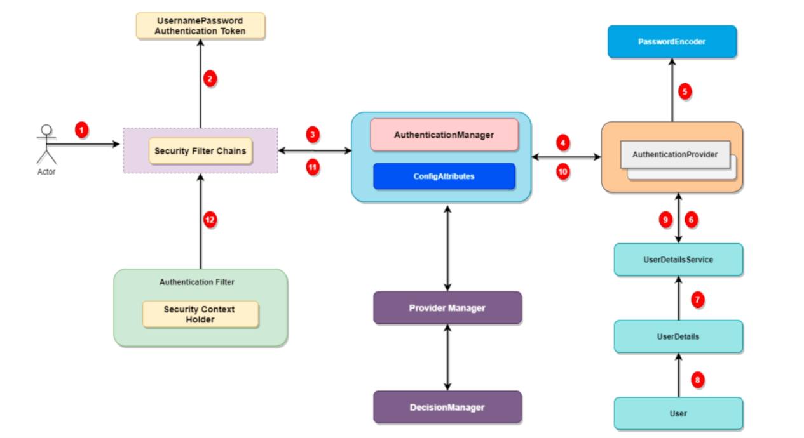

<!--toc:start-->
- [Kotlin](#kotlin)
  - [Types](#types)
  - [Null Safety](#null-safety)
  - [Using nullable types](#using-nullable-types)
  - [Classes](#classes)
  - [Delegates](#delegates)
  - [Equality](#equality)
  - [Comparing](#comparing)
  - [Singletons](#singletons)
  - [Companion Object](#companion-object)
  - [Extension Function](#extension-function)
  - [Inheritance](#inheritance)
  - [Dataclass](#dataclass)
  - [Enum](#enum)
  - [Sealed Class](#sealed-class)
  - [Generics](#generics)
  - [Variance in generic](#variance-in-generic)
  - [Scoped functions](#scoped-functions)
  - [Annotations](#annotations)
    - [Processing Annotation at Runtime](#processing-annotation-at-runtime)
- [Web Applications Architecture](#web-applications-architecture)
  - [Request Journey](#request-journey)
  - [Distributed Systems](#distributed-systems)
- [Spring Boot](#spring-boot)
  - [Program structure](#program-structure)
    - [Class Coupling:](#class-coupling)
    - [Application Context](#application-context)
    - [Autoconfiguration](#autoconfiguration)
    - [Lifecycle](#lifecycle)
    - [Autowiring by constructor](#autowiring-by-constructor)
    - [Application Properties](#application-properties)
- [Spring WebMVC](#spring-webmvc)
  - [Servlet (Java Enterprise Edition):](#servlet-java-enterprise-edition)
  - [Processing data](#processing-data)
  - [Validation](#validation)
- [Service Layer](#service-layer)
  - [`DTO`s (Data Transfer Objects)](#dtos-data-transfer-objects)
  - [Defining a service](#defining-a-service)
  - [Testing a service](#testing-a-service)
  - [Transactionality](#transactionality)
    - [Transaction properties](#transaction-properties)
    - [Isolation levels](#isolation-levels)
- [Data Access Layer](#data-access-layer)
  - [ORM (Object-Relational Mapping)](#orm-object-relational-mapping)
  - [Docker](#docker)
  - [Schema definition](#schema-definition)
  - [Repository](#repository)
  - [JPA Inner Logic](#jpa-inner-logic)
- [Domain Driven Design](#domain-driven-design)
  - [Benefits](#benefits)
  - [Bounded context](#bounded-context)
  - [Key Concepts](#key-concepts)
- [Spring Data in depth](#spring-data-in-depth)
  - [JDBC](#jdbc)
  - [JPA](#jpa)
- [Spring WebFlux](#spring-webflux)
  - [Blocking vs. Non Blocking](#blocking-vs-non-blocking)
    - [Reactive Stack](#reactive-stack)
    - [The Observer Pattern](#the-observer-pattern)
    - [Publish and Subscribe (PUBS)](#publish-and-subscribe-pubs)
  - [Reactive Frameworks](#reactive-frameworks)
  - [Reactor](#reactor)
    - [Transforming operator](#transforming-operator)
    - [Peeking operators](#peeking-operators)
    - [Filtering](#filtering)
    - [Splitting and joining](#splitting-and-joining)
    - [Collect synchronously](#collect-synchronously)
  - [Hot and Cold publishers](#hot-and-cold-publishers)
  - [Reactive I/O in Spring](#reactive-io-in-spring)
- [Coroutines and suspend functions](#coroutines-and-suspend-functions)
  - [Coroutines](#coroutines)
    - [Dispatchers](#dispatchers)
    - [Context Handling](#context-handling)
    - [Synchronization](#synchronization)
- [Flows](#flows)
  - [Spring R2DBC](#spring-r2dbc)
- [Authentication and Authorization](#authentication-and-authorization)
  - [IAM responsibilities](#iam-responsibilities)
  - [OAuth 2.0 (Authorization)](#oauth-20-authorization)
  - [Authentication Flows](#authentication-flows)
  - [OpenID Connect](#openid-connect)
    - [Json Web Token (JWT)](#json-web-token-jwt)
- [Spring Security](#spring-security)
  - [Authentication Providers](#authentication-providers)
  - [OIDC Authorization Code Flow.](#oidc-authorization-code-flow)
  - [OAuth2 Client](#oauth2-client)
  - [OAuth2 Resource Server](#oauth2-resource-server)
  - [Contact Resource Server from the Client](#contact-resource-server-from-the-client)
  - [Security at service level](#security-at-service-level)
  - [SPA/Server interaction](#spaserver-interaction)
  - [CSRF protection](#csrf-protection)
- [System Integration](#system-integration)
  - [Enterprise Integration Pattern (EIP)](#enterprise-integration-pattern-eip)
    - [End-points](#end-points)
    - [Channels](#channels)
  - [Apache Camel](#apache-camel)
    - [Google Mail Integration](#google-mail-integration)
    - [Calling Camel from Spring](#calling-camel-from-spring)
- [MongoDB](#mongodb)
  - [Documents](#documents)
  - [CRUD operations](#crud-operations)
  - [Aggregation pipelines](#aggregation-pipelines)
  - [Indices](#indices)
  - [Transactions](#transactions)
  - [MongoBD in Spring](#mongobd-in-spring)
- [Message Brokers](#message-brokers)
  - [RabbitMQ](#rabbitmq)
  - [Apache Kafka](#apache-kafka)
    - [Producer and Consumers](#producer-and-consumers)
    - [Topics](#topics)
    - [Generic consumer](#generic-consumer)
- [Microservices](#microservices)
- [OpenAPI](#openapi)
<!--toc:end-->

# Kotlin
## Types
All types are references types in Kotlin, they will be optimized later by the compiler if possible, this removes the problems that Java was carrying, like the difference between boxed and unboxed type`int` vs `Integer`, etc.

## Null Safety
Java is affected by Null values, they are part of the language to signal the absence of a value, Kotlin improves on this by embedding in the language the possibility for a type to be Null directly inside the type. Kotlin has two types of values (the third one will be discussed later), **non-null-types** and **null-types** obtained by appending a `?` at the end of the value. Kotlin puts the type `Any` at the top of the class hierarchy (every class inherits Any), like `Object` in Java, while at the bottom of the hierarchy it puts `Nothing` (every class is inherited by Nothing). As we said earlier every type has its nullable counter-part, in fact `Any?` and `Nothing?` are both types, the `null` value is the only instance of the `Nothing?` type. On the other hand `Nothing` contains no possible value, using the kind of abstraction the compiler can do assumption based on the code for optimizations or for checking, e.g. an exception as no possible value, we use the `Nothing` type to mark this return value, or if the main contains an infinite loop and that function is never supposed to return, the return value can be specified to be `Nothing`. The `Noghtin` type is like the concept of 0 in math.

## Using nullable types
- **safe-call operator** (`?.`): call the method/paramter if the object is not null
- **elvis operator** (`?:`): returns the value on the right if the object on the left is null
- **non-null operator** (`!!`): move the null-check at runtime

```kotlin
var a: String = "abc"
var b: String? = "abc"
b = null
var len: Int? = b?.lenght
```
In Kotlin everything has a return value, `void` is replaced with `Unit`, which is a class and the only possible instance of that class. Like Rust also in Kotlin every scope has a return value, e.g. `val a = if (0 == 0) \{ 1 \} else { 2 }`, in this case `a` will have value of 1.

Kotlin assumes that nothing is inheritable unless it's explicit, this avoids many of the problem on inheritance. In Kotlin there are two kinds of attributes, variables (`var`) which are values that can change, values (`val`) which means that the value is not reassignable, and not immutable.

Functions types: in Kotlin the types of a function is defined as the set of types of the parameters inside parenthesis and the return value after the arrow (`->`): `(String, Int) -> Unit`. To declare a function we use the keyword `fun`, to assign a function to a variable we use the (`::`) before its name, `val a: (String) -> Unit = ::greet`. This allows function in kotlin to be: **higher order functions** and **first class citizens**.

## Classes
Classes have a default constructor defined with parenthesis after the name of the class, the `init` scope is run after the constructor is called, moreover secondory constructors can be defined with the `constructor` keyword, in the end they must call the primary constructor to build the object.

Properties of a class can have the `set()` and `get()` methods, this are methods which allows to read and write properties of a class, also by adding additional logic, this is done to render our programs more readable.

## Delegates
Delegates are useful to have properties provided by somebody else, they can be used with the keyword `by`.
- One of these properties can be Lazy, where the initialization is delegated to the class Lazy, this is useful when a property creation is very expensive and very rare in our application.
- by Observable, the value can be subscribed by a third-party, invokes a listener when the property changes.
- by Vetoable, can observe the change before the change is happened, we can e.g. allow or block the operation based on some conditions.
```kotlin
val lazyValue: String by lazy { 
  print("computed!")
  "Hello"
}

fun main() {
  println(lazyValue) // -> "computed!" + "Hello"
  prtinln(lazyValue) // -> "Hello"
}
```


## Equality
When are two objects are the same? Equality in logic has three properties:
- Reflexive (anything is equal to itself)
- Symmetry (if a = b then b = a)
- Transitivity (if a = b and b = c then a = c)
Kotlin by defautl will rely on the native equal (from Java) which means comparing the pointers of the object (Identy equality), and it is derived from the `Any?` class. This is difficult when dealing with subclasses, when is an object equal to another? The answer to this question is not immediate, it depends on the domain we are dealing with.

In Kotlin two when objects that are equal they need to have the same `hashCode()`, the opposite is not true.


## Comparing
We need to implement the `Comparable` interface for a class, it only contains a method called `compareTo(other: T): Int`, if the return value is positive this is bigger than the other, if negative then it's the opposite.

## Singletons
We can declare a singleton with the object keyword, instad of class. There is only one instance.
```kotlin
object MySingl {
  private var _counter = 0
  fun increament() { ++_counter }
  val counter = _counter
}

MySingl.increment()
println(MySingl.counter) // -> 1
MySingl.increment()
println(MySingl.counter) // -> 2
```


## Companion Object
Replaces the `static` keyword in java. This allows to have properties to be already initialized when calling an object, this will be an object that will be automatically instanciated at the program creation. Companion objects are not bound to a single instace of a class, it can accessed by globally by anyone.


## Extension Function
This are special funciton that can extend the methods of a class. This is just a syntactic sugar for the programmer, in the end it will be converted to just a function with the class as the first parameter.

```kotlin
fun <T> List<T>.second(): T? = if (this.size >= 2) this[1] else null

val list = listOf("one", "two", "three")
println(list.second()) // -> two
```


## Inheritance
Kotlin discourages the use of inhritance, in fact by default class cannot be extended. Inheritance breaks a lot of things. Other than that we also need to explicetly specify which methods can be ovverridden, using the `open` keyword. And in subclasses we need to use the `override` keyword to reimplement the method of a parent class.

```kotlin
open class Base(val p: Int) {
  open fun method1(): Int = p

  fun method2(): String = "Cannot be overridden"
}

class Derived(p: Int) : Base(p) {
  override fun method1(): Int = p * 2

  // I can't write this.
  // the method is interpreted as final (Java)
  //override fun method2(): String = ...
}
```


## Dataclass
Dataclasses are very useful, in many cases. It's a class with some restriction and some benefits.

**Restrition**:
- cannot be extended
- cannot be abstract
- cannot be sealed or inner

**Benefits**:
- implementation of: equals, hashCode, toString, copy (create a clone of existing object), component1(), ..., componentN()

The `componentX` allows to implement a destructuring operation. `data class Point(val x: Int, val y: Int); val (x, y) = Point(1, 2)`


## Enum
Enum is a way to create enumerations which allows to limit the possible alternatives. Enum classes can also store properties.

```kotlin
enum class HttpStatusCode(val value: Int) {
  OK(200), NotFound(404), ...
}
```

## Sealed Class
Like rust Enum types, it's algebreic sum type. This is possible because sealed classes can be extended only insid the same file. At compilation all possible subclasses will be known.

```kotlin
sealed class Result
data class Success(val data: List) : Result()
data class Failure(val error: Throwable?) : Result()

fun processResult(result: Result): List = when (result) {
  is Success -> result.data // I can treat `result` as `Success` class
  is Failure -> listOf()    // The same, but with `Failure`
}
```

```kotlin
sealed class Option<out T>
data class Some<out T>(val data: T) : Option<T>
object None : Option<Nothing>

//...
```

## Generics
Following Java, generics are implemented as type erasure. Only during compilation generics are known, they are forgetten at run-time. Since java and kotlin have a reflection system, what the JMV will do is to convert the list of type `<T>` to a list of type `<\*>`, which is a list of anything.

We put restrictios using the `when` keyword

```kotlin
fun <T> sort(l: List<T>) where T: CharSequence, T: Comparable<T> { ... }
```

```kotlin
class Box<T>(val content: T)

val b1 = Box("test")
val b2 = Box(42)

val s: String = b1.content
val i: Int = b2.content
// val b = b1 is Box<Int>
// Cannot check for instance of erased type: Box<Int>
```

## Variance in generic
How is it possible to handle subclasses and supersclass of a generic type `T`? With generic we can use the concepts of **covariant** and **contravariant** types. Where **covarient** `<out T>` means that you can use subclasses of `T`, **contravariant** `<in T>` means that you can use superclasses of `T`.

```kotlin
interface Source<out T> {
  fn next(): T
}
```

```kotlin
interface Sink<in T> {
  fn put(t: T)
}
```

## Scoped functions
Extension function that can operate on generic types. Heavily used in Kotlin library "`let`, `run`, `apply`, `with`, `also`, ..." These are also called scoped funtion with receiver.


## Annotations
Annotations are a special kind of class (declared with the `class annotation` keyword), used to define some metadata associated with a function, class, parameter, etc. Annotations gives us a set of APIs for the reflection system to inspect the objects created by us.

Usage:
- Used to declare our intentions to other programmers that will read the code (e.g. `@Suppress`)
- Used to generate extra code at compile-time or at run-time

Annotation classes can be annotated as well. THere are few predifined.
- `@Target(vararg at: AnnotationTarget)`: domain to of our class were it can be applied
- `@Retention(ar: AnnotationRetention)`: the compiler will generate code from the annotation, but it will swallow it. It can be embedded in the byte code and then swallowed later. Or it can be craeted at run-time (using regflection).
- `@Repeatable`: annotation can be applied multiple times.
- `@MustBeDocumented`: 

In Kotlin to disambiguate some cases there is a special syntax
```kotlin
class Person(@get:GetterAnnotation val name: String)
class Person(@field:FieldAnnotation val name: String)
class Person(@param:ConstructorParamAnnotation val name: String)
```

### Processing Annotation at Runtime

Processing Annotation at runtime via reflection.
```kotlin
@Retention(RUNTIME)
@Target(FIELD)
annotation class RelevantField

data class SampleClass(var a: Int, @field:RelevantField var b: String)

fun getRelavnat(obj: Any): List<String> {
  return obj.javaClass
    .declaredFields
    .filter {
      it.isAnnotationPresent(RelevaltField::class.java)
        && (it.canAcess(obj) || it.trySetAccessible())
    }
    .map { "${it.name}: ${it.get(obj)}" }
}
```

***IMPORTANT!***: It's important to remember that annotations don't act any modificaions on the code by themselves, but other components will act on those elements with the presence of annotations.


# Web Applications Architecture

Reliable applications properties:

- Idempotence: a given block should not duplicate the effect or messages.
- Immutability: design our system in such a way that nothing is overridden or deleted. If we want to deleted something we add a flag that tells us what we want to delete (like Git versions).
- Location Independence: the behaviour of an application should not depend on where the application is located.
- Versioning: keep track of our application changes.

When building web applications there also some fallacies that very often are believed to be true, but they never are:

- The network is **reliable**
- **Latency** is zero
- **Bandwidth** is infinite
- The network is **secure**
- **Topology** does not change
- There is one **administrator**
- **Transport** cost is zero
- The network is **homogeneous**

To address unreliable network (API calls), implementing idempotent APIs helps us:

- REST based architectures
- POST associated an ID to a request

Nowadays, web applications use HTTP(S) methods to exchange data with their clients. Typically web application are designed in a way such that those clients can perform some business logic (The **Business Login** is how the information is managed by the application).

Usually the approach that we use is a *tier level*:

1. **Client tier** (Front-End): Usually a web-browser or mobile applications, which does HTTP(S) requests over the internet.
1. **Web Tier** (Back-End): Is in itself split in many tiers
    1. **Presentation Layer** (Public Part): exposed to the internet, handling messages (Request, Responses), forwarding them to the service layer. Information exchanged are **DTO**s (Data Transfer Object), which is usually represented as a `json` object.
    1. **Service Layer**: can contact the data access layer, delegate part of its information to another server, e.g. for back payments we forward the traffic to another server (PayPal, ...).
    1. **Data Access Layer** (Private Part): where the majority of things happen, inside the data is represented as **Domain Model**s which is how the data is represented internally, how the designer has conceived that service.
1. **Data Tier** (Back-End): is where the data is stored and where the data constraints are checked.

Information exchanged:

- (Public) DTOs: Data Transfer Objects, data transferred to the internet, encoded in such a way that it's convenient to exchange, in modern systems the majority of data gets shared as `json`.

- (Private) Domain Models: data kept internally, this is how the designer of the system interpreted how data should be handled and represented. This modularity allows for both Public and Private services to evolve separately from each other.

The Web Tiers should be designed in a stateless way. All that is manipulated is ephemeral, if a state must be present it should be by means of databases. In this way we can create many Web Tier instances, load balancers can create how many of them as they want to distribute the traffic in the most appropriate way.

- **Presentation Layer**: Encodes/Decodes answers as they come, and checks their formal validity, if it accepts the data they are forward to the layer below.
- **Service Layer**: Implements the application business logic, defines the contract between the user and the application. Each requirement is mapped `1 to 1` to a method that can be invoked. Typically, those methods are used in a transactional way, if one operation fails then the whole chain should be rolled back. It manipulates DTOs (usually a data class with fields for the different operations), and internally it converts them to an **Entity** representation. Services should not leak the internal details of how the data layer is composed.
- **Domain Model**: It represents domain concepts, it is suitable for the data representation in our data layer. If we use *MySql* the data representation will be different from a *MongoDB* data representation.
- **Data Access Layer**: It is responsible for persisting Entities or Documents coming from the Service Layer. Typically, it consists of a single application (DMBS) which is able to execute commands.
- **Data Tier**: Consists of one or more database, which could also have different technologies between them.

## Request Journey

1. DNS request when a user contacts a URL, then I get an IP address
1. Usually the IP address I receive is one of a **Load Balancer**, after a policy I will get to one of many web app servers.
1. The request is analyzed by a web application
1. The web application directly contacts a database
1. The web application can also contact a cache for fast retrieval
1. The web application can use **Job Queues**, which can be executed in a deferred later (The jobs can be deferred on a different server).
1. It can also use **Full Text Search**, to deal with the user **Natural Queries**.
1. After the request has been analyzed it can be forwarded to a different service (like a payment service).
1. Some request can be forwarded to a **Data Warehouse**, where some analytics can be extracted from them, usually data is not stored immediately, but they are stored on a queue awaiting to be analyzed.
1. A copy of this data can also be shipped to some **Cloud Infrastructure**.
1. Some caching can be used to reduce latency between Server and Client using a CDN network (Content Delivery Network).

## Distributed Systems

When we deal with distributed system we also need to deal with a **Distributed State**, every process can have their own copy of the data, in those cases it's very difficult to have strong consistency, which means that states needs to be propagated to all the services, in those cases we will talk about a state that will be **eventually consistent**, but in those transition is where the problems occur. We can also have distributed transactions which introduce locking, which leads to not being able to scale.


# Spring Boot

When Spring was first created, to model the set of actions that were possible, object-oriented programming was used and a network of objects is used to solve this problem.

The framework allows us to create multiple components, that will be interconnected between each others, the engine will do the work to connect them accordingly, this is possible because when the framework loads classes it will inspect them and check if they contain annotations. The idea of linkable classes is called `Bean`s. Each `Bean` will be loaded by a `Container` or `ApplicationContext`, which will inspect them and act accordingly. This is why `Bean`s are the basic building block of a Spring application. Spring as soon as it recognises a `Bean` it can perform an operation called `Wireing`, which means to provide objects were they are needed, without specifying how to do it (it can also be done through a user-provided one). This also allows spring to compile the project into a unique big jar file called **uber-jar**. To create a Spring application we can use [Spring initializr](https://start.spring.io).

## Program structure

We create a class marked with `@SpringBootApplication`, if we mark methods with `@Bean` those methods will be responsible with creating objects.

One very difficult task to do is to be able to build a complex architecture inside our program, the way spring does this is by using 3 fundamental ideas:
- **Inversion of Control**
- **Dependency Injection**
- **Aspect Oriented Programming**

The reason why these concepts are important is to explain many problems, these problems could be encountered when designing complex relationships.

### Class Coupling:

It's when a class depends upon another, it means that one is tightly coupled to another, which we cannot create those classes in a separate way, one depends upon the other.

We can use **Inversion of Control** to decouple classes dependencies. It abstracts the functionality of the dependent class.

```kotlin
interface Quest {
  fun embark()
}
interface Knight {
  fun emarkOnQuest()
}

class RescueDamselQuest : Quest {
  override fun embark() {
    println("embark")
  }
}

class BraveKnight(private var quest: Quest) : Knight {
  override fun embarOnQuest() {
  }
}
```

In this way a knight only knows that it has a quest, but the given details are not known, in this way we abstract the logic and the usage can be generic. In this way the `Quest` passed to the constructor can any kind of quest.

Who supplies the proper class that implements the interface? Here the **Dependency Injection** comes to help to inject the dependency of a class that did IoC. For example in Spring there is an `ApplicationContext` that will automatically inject the dependencies, it will see that the constructor needs a class that implements the `Quest` interface, then it will automatically recognise and insert the `RescueDamselQuest`. In Spring if we mark a class with `@Component` annotation it will be automatically injected as a dependency.

If we have more than one implementation for an interface, spring cannot infer which one to inject, we can solve this for example by annotating one of them as `@Primary`, or by using other annotations to specify the order of injection.

The **Aspect Oriented Programming** is a paradigm based on knowing that often our code is responsible to perform behaviors not strictly related to a specific class. A set of classes have a common problem, but in the way they are used they need a common way of operating. We can take a set of common concerns and factorize them in a single place (*cross-cutting concerns*). For example in spring we can create an `@Advice`, where we can write code that will be shared among different components. This allows to preform actions *before* the invocation or after the *invocation* of a function, e.g. in the case of **transactions** we want to start the commit before and commit after the invocation.

```kotlin
@Target(AnnotationTarget.FUNCTION)
annotation class Timed

@Aspect
@Component
class LogAspect { 
  @Around("@annotation(Timed)")
  fun log(joint: ProceedingJoinPoint): Any? {
    val start = System.nanoTime();
    try {
      return joint.proceed() // this represent in an abstract way the wrapping of the annotated method
    } finally {
      val end = System.nanoTime()
      println("Execution time: ${end-start} ns")
    }
  }
}
```

Whenever we will use the `@Timed` annotation, the additional code will be automatically generated and inserted dynamically.

```kotlin
@Component
class BraveKnight(private val quest: Quest) : Knight {
  
  @Timed
  override fun embarkOnQuest() {
    quest.embark()
  }
}
```

### Application Context

Where are the dependencies kept? The Main is responsible to instantiate the `ApplcationContext` where all the dependencies are stored. In Spring there are specialized classes that already implements the `@Component` annotation, those components are:

- `@Controller`/`@RestController`: Component that contains method to receive and return HTTP request/responses, every method annotated with `*Mapping("<url endpoint>")` is and endpoint of the application where the `*` is any of the HTTP methods.
- `@Service`: Components that contains the business logic of our application.
- `@Reposiotry`: typically each repository correspond to each table in the database and it is the one responsible to perform operations on it.
- `@Configuration`: Component that contains method marked `@Bean` will trigger the creation of their `Bean`s, which can be Autowired.

### Autoconfiguration

Many objects are instantiated when the program is run, for example in the default configuration there is a Tomcat server started by spring, which in spring is also a `@Component` and will be automatically created. Libraries can tell Spring to create other Components. This is possible because Spring has an `Autoconfiguration` where it will pick the default dependecy provided by the libraries, in case the user did not provide anything.

### Lifecycle

Every component has a specific lifetime, in spring we can specify how long a `Bean` should live, for example it's possible to bound a lifetime the life of the application, it's possible to be bound only during the handling of a request, when the handling of a request terminates the associated `Bean`s will be removed, it's possible to bound the lifetime to a request from a specific user, spring will not destroy that `Bean` for 10 minutes if no new requests come from that user. We can specify the lifetime using the `@Scope` annotation (which is not specified is `Singleton` by default), we can also specify a method that will be called when the `Bean` is created or destroyed with `@Bean(initMethod="...", destroyMethod = "...")`.

### Autowiring by constructor

If more implementations to create a single `Bean` are provided we can attach each instance to a `Profile`, and in the configuration depending on what we are doing (deployment, testing, ...), the appropriate `Bean` will be selected. We can also specify `@Qualifier("...")` on the autowired `Bean` thus allowing to inject a class based on a qualifying string.

### Application Properties

We can read the keys in the application properties file using `lateinit var` in case we need a configuration that we can change

```kotlin
// This property will be autowired
@Value("${server.port}")
lateinit var part: String
```

# Spring WebMVC

In Spring, we already defined a layered architecture, where a `Controller` is the component responsible for handling the HTTP connections, where that one will exchange `DTO`s with a `Service`, which internally it will translate that `DTO` to suite the `DataSource` representation.

How the connections typically happens in SpringMVC is that each request is handled by a single thread, if the number of request outweighs the number of threads they remain in the socket until some thread is freed and collects the request, if no request is coming we still have all the available created threads on yield, which still consumes memory.

Spring supports two ways to build web application (two ways of handling concurrency).

- **MVC**: create many threads to handle each request
- **WebFlux**: we can use asynchronous programming, by using all the available thread of a system we can split the load among them, instead of creating thousands of threads that will handle each request.

## Servlet (Java Enterprise Edition):

A Servlet is an abstraction, it's supposed to be the minimun unit of computation (a class that handles a request and produces a response). Some more specific subclasses exist (`HTTPServlet`). The approach servlet took it's the same that SpringMVC uses: one-request-per-thread.

```html
<!DOCTYPE html> 
<html xmlns:th="http://www.thymeleaf.org">
<body>
  <h1>Home</h1>
  <p th:text="Now is ${date}"></p>
</body>
</html>
```

## Processing data

We can supply data to a controller using: `@RequestParam`, `@RequestBody`, `@PathVariable`. It's also possible to supply request parameters inside an object, Spring will automatically grab all the request parameters and assign them to the provided objects and the sub-objects in the function parameters.

## Validation

We use spring validation to validate requests from the user, using `@Valid`, `@Min`, `@Max`, `@Size` on the fields of a Kotlin data class, this allows for an easy validation of the user requests.

```kotlin
data class ReqDTO(
  @field:Size(max = 255)
  @field:NotBlank
  val test: String,
  @field:Valid
  val sub: SubReqDTO,
)

data class SubReqDTO(
  @field:Size(max = 255)
  @field:NotBlank
  val sub: String,
)
```


# Service Layer

The service layer is right below the controllers, it will accept the request and exchange data with the data layer.

## `DTO`s (Data Transfer Objects)

`DTO`s are the objects that the server exchanges with the client, when the `DTO` will enter the service layer, they will be converted to an internal model representation, which suits the DB internal entities.

## Defining a service

The service is defined as an interface, this allows the programmer to provide a set of methods that each will be mapped to a requirement of the application.

A service once an interface is defined, we can provide an implementation were the logic is contained, for instance a service can be annotated as `@Transactional`, this will cause all the methods to be marked as transactional, and to be rolled-back if an error occurs, in fact a service deals with data, but it does not know where to store them, this will be the job of a [repository](#repository).

A service can also prevent the access to a method if unauthorized, for example it can be annotated with `@PreAuthorize("hasRole('ROLE_ADMIN')")` which prevents the access to anyone that is not an admin.

## Testing a service

We can use **Unit Testing** to test our services, in unit testing we need to provide all the dependencies to a service in order to be created and tell to the dependencies how to behave. In unit testing we use **AAA** methodology, which stands for **Arrange**, **Act** and **Assert**.

```kotlin
internal class UserProfileServiceImplTest {
    @Test
    fun `loading an existing profile should return a valid DTO`() {
        //Arrange
        val repo = mockk<UserProfileRepository>();
        every { repo.findByName("name") } answers  {
            UserProfile(1, "name", LocalDate.of(2000,1,1))
        }
        val service = UserProfileServiceImpl(repo);

        //Act
        val dto = service.loadProfile("name")

        //Assert
        assertEquals(dto.id, 1L)
        assertEquals(dto.name, "name")
        assertEquals(dto.dateOfBirth, LocalDate.of(2000,1,1))
    }
}
```

## Transactionality

Be default a service is **stateless**, this does not mean that the logic should be stateless, for example when calling methods of the repositories and we need to check the consistency of the data when multiple users act on the same resources, we can tell spring which methods (or classes) should be transactional using the `@Transactional` (from `org.spring.framework.transaction.annotation`), which will internally call the `PlatformTransactionManager`.

### Transaction properties

- **Atomicity**: the operations are either all passed, or none is applied
- **Consistency**: at any give time the database is in a consistent state
- **Isolation**: each transaction operates independently of one another
- **Durability**: a db remembers our data

### Isolation levels

DBs still have to deal with some levels of isolation, to avoid some phenomenon that can happen during a transaction, SQL defines 4 level of isolation:

- **Serializable**: (highest level)
- **Repeatable read**: phantom-reads
- **Read committed**: non-repeatable-reads, phantom-reads
- **Read uncommitted**: dirty-reads, non-repeatable-reads, phantom-read

With **serializable** still the following anomalies can happen: dirty-writes, read-skew, write-skew, lost-update.

Anomalies:

- **Lost-update**: this happens when two transactions are created at the same time and are being run on the same row, one updates the rows and commits, the other updates the rows can commit after the first one, only the last update will be stored, and the other one will be **lost**, while both think that the operation was successful. We can resolve this situation with an **optimistic lock**.


# Data Access Layer

Services contains business login, but does not contain any state, it delegates that tasks to repositories which will store the data to a database.

Spring data framework provides a library called JPA (Java Persistence Architecture), which is based on Hibernate which created a declarative approach to deal with SQL queries, JPA is just a rebranding of Hibernate, the positive part is JPA makes easy to switch the underlying layer for creating queries.

The main class of the data access layer is called a `Repository`, each `Repository` will fetch a list of `Entity`, which are the basic blocks that it's possible to retrieved from a database.

## ORM (Object-Relational Mapping)

ORM tries to fill the difference between the world object orient programs and the world of relational databases. The main big difference is that while it's completely fine in the world of the relational databases to have bidirectional relations (e.g. when a table A has a foreign key pointing to another table B it's completely legal to do `select * form A join B` and `select * from B join A`), this is problem in programming because pointers (which are used to create relationships) are not bidirectional, if A points to B, from B we cannot go back to A.

ORMs are responsible to handle queries behind the curtain, while still using plain objects.

## Docker

In Spring v3.0, it's possible to use docker compose to create a connection with a db of our choice, like Postgres, MongoDB, Redis, ... This is possible by using a `compose.yaml` file in the root folder, in this way spring will be able to spin it up on its own and then create a suitable connection with the database, this is very useful during development. In production though we still need to specify a db connection using Spring properties.

To configure a connection we can use the following properties in the `application.yaml`

```yaml
spring:
  datasource:
    url: jdbc:postgres://localhost:5432/db
    username: test
    password: test
```

## Schema definition

We can use schema definition to specify how JPA should interact with the database

- `validate`: only validate the schemas on the db with the entities present in project (option to use in *production*)
- `create-drop`: as soon as the application start the db will be wiped and tables will be recreated
- `update`: the db tables will be updated if they are not equal to the entities
- `none`: nothing will be done

## Repository

Repositories are JPA interfaces that allows the exchange of the entities with the DB.

- `Repository<T,ID>`: provides no methods
- `CrudRepository<T,ID>`: provides basic CRUD operation on an entity
- `PagingAndSortingRepository<T,ID>`: allows sorting and paging the list of entities
- `JpaRepository<T,ID>`: adds batching operations in order to perform massive operation of insertion/retrieval

Repositories will contain an `EntityManager` inside of them which will actually perform the operation on the entities.

It's also possible to add methods to the repositories, annotating methods with the `@Query('select * from User')` it's possible to define custom queries using `JPQL` (a *SQL dialect* of JPA). It's also possible to use natural language to define the queries, like `fun findByNameAndSurame(name: String, surname: String)`, where `name` and `surname` are fields of the entity.

## JPA Inner Logic

When an `Entity` is used, that entity is both an object in the language and a row in the database. When we create a new entity it will not be tracked by the database, it is in a `detached` state, when we call `.save()` from the repository, that entity will be persisted (in fact what happens in the back is that the entity will manager will call `.persist()`). At this point the entity is in `Attached` state.

For this reason we only exchange DTOs with the service, if some operation are performed on a tracked entity, the changes will be forwared to the db.

Low level ORM access:

- `find(entityClass, primaryKey, lockModeType)`: get an entity from the database
- `persist(entity)`: takes the entity and modify all the fields in the DB row if it exists, or create a new row if it doesn't exist
- `refresh(entity)`: I have an entity with some modification I don't want to persist, these methods throw away the current data and re-fetch the actual one from the DB
- `remove(entity)`: deletes the entity from the database
- `detach(entity)`: the changes will no more pushed to the DB, also discarding any change


# Domain Driven Design

A totally different way to design the application differently based on how spring does it.

Language is ambiguous, e.i. in an airport we have names for that domain, a departure for example is the start for the journey for travelers and the end of the job for airport workers, depending on the perspective of the person that word can have a different meaning, this is why engineers need to collaborate with domain experts. In DDD we want to create teams with Domain expert which will lead the building of the application in the right way.

## Benefits

A system should be split in parts and each part should have a clear separation of concern.

Each part has a different role, and they are called **Domains**. They are divided in:
- **Support Subdomain**: something that is needed but is not specific to that application, e.g. many applications need to store documents, there is nothing inherently special in this generic operation, if a system does implement this operation it is to support other operations.
- **Generic Subdomain**: e.g. designing a good login service is very difficult, many companies have the same problem, but it would be stupid to recreate each time this component, when someone creates a library that is secure and reliable then the problem is solved for everyone.
- **Core Subdomain**: it's difficult to implement highly differentiated logic from everybody, those components are vital for the application inner working.

> ***Software is worth if it brings value***, this is main idea that DDD brings.

## Bounded context

Different departments interpret entities in a very different way, and we need to take into consideration this differences and the overlapping similarities.

Strategic vs tactical design:

- Strategic: am I designing the right things?
- Tactical: am I designing things right?

They are both relevant and useful.

## Key Concepts

- **Entity**: concepts that is represented in the database and is identifiable (unique ID), and the ID will be constant for its entire lifecycle, in DDD entities contains **methods**, in JPA entities represent table structure, in DDD an Entity is like a Service in Spring. Our system will behave with the various Entities.
- **Value Objects**: objects are in DDD what we typically assign as attributes in JPA entities, but we create an object out of it in DDD, because also attributes has behaviors, e.g. a price is not only the quantity of money, but it also has a currency, this will cause the amount to vary in different countries of the world and even day by day (stocks market).
- **Aggregates**: it's an object composed of other objects, where each object refers to other objects. There is a **root aggregate** where the tree of objects originates. Aggregates always form graphs, and each aggregate can link to another aggregate, but it can only be done in a unidirectional way (tree style, no loops).
- **Repository**: tooling for storing objects.
- **Services**: express some part of domain logic, usually used for transactionality.
- **Factories**: used to create aggregates, validates all the necessary constraints.
- **Domain Events**: letting one system informing another system that something happened.

# Spring Data in depth

Repositories are interfaces used to retrieve entities. Spring supports both JPA entities and JDBC DDD.

## JDBC

JDBC offers native support for DDD pattern, like the automatic emission of events with `@DomainEvent` which will enable reactive approaches. It's also possible to use `@AfterDomainEventPublication` to allow for various cleanups.

```kotlin
// Entity
data class Warehouse(@Id val id: String, val location: String) {
    @MappedCollection
    private val inventoryItems = mutableSetOf<InventoryItems>()

    fun addInventoryItem(inventoryItem: InventoryItem) {
        _domainEvents.add(InventoryItemAdded(this, inventoryItem))
        inventoryItems.add(inventoryItem)
    }

    private val _domainEvents = mutableListOf<Any>()

    @DomainEvents
    fun domainEvents(): List<Any> = _domainEvents

    @AfterDomainEventPubblication
    fun cleanup() {
        _domainEvents.clear()
    }
}

data class InventoryItem (@Id val id: String, val name: String, val count: Int)
```

## JPA

Uses ORM (Object-to-Relational Mappings) under the hood to keep in sync objects and database tables.

We have a `Persistance` interface, useful when working with multiple databases. It provides an `EntityManagerFactory` which maintains an active connection with a database, whenever in spring we create a repository, the framework will automatically inject into it an `EntityManager`, create by the factory, which manages storing entities, and keeping them in sync with the database.

<+>


# Spring WebFlux

There are some situations in the code when some operations are performed where the thread has to wait for the operation to complete, these operations are blocking calls, e.g. when we make a call to the database we need to wait for it to get all the entities and then return, for IO operations, web requests, etc. 

In principle, it would be way better if those blocking call would just stay in the background and when the request comes back we execute a callback, while in the meantime we do something else, in this way we create a non-blocking request.

```kotlin
// Blocking
val req = createRequest()
val v = readData(req)
process(v)

// Non-blocking
val req = createRequest()
readDataAsync(req) { v -> process(v) }
```

How can we write `readDataAsync`? It's very complicated, it would be possible using recursion but the code becomes too much garbled.


## Blocking vs. Non Blocking

All methods that for example use the database are blocking, this means that the thread will be stuck on the call site until that function completes, we can avoid this by creating a new thread, in this way it can do other things and not wait util the function completes.

We could have a simple solution, we pass a callback to the function, and when it will finish the callback will be called, thus allowing the execution to continue freely.

The first to implement the concept of `async/await` was Microsoft in C#. Later at Netflix the problems was that they could not handle high traffic spikes, they were able to solve the problem by defining a reactive stack (RxJava), later ported to other languages.

Spring later took those concepts and created the Reactors. The use of those reactive libraries, is very cumbersome, still better than writing callbacks, but there was a way to achieving the aim the asynchronous programming.

At Jetbrains they used an old concept called **coroutines**. Coroutines help us to write asynchronous code like imperative code.

### Reactive Stack

Instead of having functions that block when called we have to make them `async`. To do that we have to reimplement our whole stack from the ground up (sockets, ...). 

Spring Web Flux (based on Jetty),

Servlet Stack vs. Reactive Stack: in servlet (concept of Tomcat) each request is handled by a single thread, in the reactive stack everything is asynchronous, every thread can contribute to the pipeline.

Imperative programming
```kotlin
var x = 2
var y = 3
var z = x * y
// z is 6

x = 10 // z is still 6
```

For example in Excel if create a cell which created by computing a formula from the other cells, if those cells change also the result is updated accordingly, this is because the that cell only the formula is stored, and not the value, Excel has a reactive approach. A Reactive approach means to be able to respond to changes.


### The Observer Pattern

There is some source of information, and somebody is interested to this source of information.

There is a `Subject` which internally keeps a list of subscribers. Other than that it has methods to `subscribe`, `unsubscirbe` and `notify`.

The observer pattern described in this way is very slow in a blocking way, for example if two observers came from two different threads locking must be used. How do we notify the subscribers:
- **Synchronously**: we invoke a method, we iterate through the observers, and we call the event they provided, but if that method is slow the others will not be notified.
- **Thread Pool**: we notify each observer using a thread per-each, if one observer is slow, it might start receiving event out of order, and they can start to overlap, maybe the one that came later finish first, we may cancel that event, but cancellation is different

### Publish and Subscribe (PUBS)

In this new pattern, the subscriber does not know the identity of the publishers, but it contacts a middle channel called `Event Channel` which act as an aggregator, which means that a subscriber can receive a notification from many publishers. 

Spring provides this by default, we can annotate a class with `@EventListener` where we can specify a set of topics, in my application is creating such events my class will receive that event.

Problems: there is no way of cancelling those received events, there cannot be error recovery (the publisher does not know anything about the subscriber), when the load increases the event channel may be significantly stressed.

## Reactive Frameworks

To define reactive frameworks we need to define 4 interfaces, it's a mixture between the **Observer** and **Iterator** patterns and **Functional programming**.

- `Subscriber<T>`: as long the methods `onError` or `onComplete` are not called the subscriber can keep receiving data with `onNext`

```kotlin
interface Subscriber<in T> {
  // Invoked after calling
  // Publisher.subscribe(Subscriber)
  // No data will start flowing until
  // Subscription.request(long) is invoked
  fun onSubscribe(s: Subscirption)

  // Invoked by publisher if subscription is active
  // and a request for more data has been issued
  fun onNext(t: T)

  // Fail terminal state. 
  // No more invocations will be received
  fun onErrot(t: Throwable)

  // Successful terminal state. 
  // No more invocations will be received
  fun onComplete()
}
```

- `Subscription`: the subscription informs the publisher the readiness of the subscriber to receive information

```kotlin
interface Subscription {
  // Ready to process n callbacks
  // performs backpressure: it means that even if the publisher is
  // ready to publish new data, the subscriber
  // cannot process those data
  fun request(n: Long)

  // Tells the publisher to cancel all the information even if
  // it already produced them
  fun cancel()
}
```

- `Publisher<T>`: the one who produces the data. In a typical flow the `Subscription` will handle how much data has to be delivered to the `Subscriber`

```kotlin
interface Publisher<T> {
  // Request Publisher to start streaming data
  // This can be called multiple times, 
  // each time starting a new Subscription
  // Each Subscription will work for only a single Subscriber
  // A Subscriber should only subscribe once to a single   
  // Publisher
  // If the Publisher rejects the subscription attempt 
  // or otherwise fails, it will signal the error via 
  // Subscriber.onError(…)
  fun subscribe(s: Subscriber<in T>?)
}
```

- `Processor<T, R>`: acts in between the pipeline, typycally implents operations such as `map()`, `filter()`, `reduce()`

```kotlin
// A Processor represents a processing stage
// which is both a Subscriber and a Publisher
// and obeys the contracts of both
// T is the type of element signalled to the Subscriber
// R is the type of element signalled by the Publisher
interface Processor<T, R> :
  Subscriber<T>, Publisher<R> {}
```

## Reactor

Publisher interface in Reactor are implemented through `Flux` and `Mono`, `Flux` delivers any number of data while `Mono` delivers at most one element.

```kotlin
Flux.just("A", "B", "C")
  .suscribe(
    data -> log.info("onNext($data)"),
    err -> { },
    () -> log.info("onComplete()")
)
```

Once we have a producer they have a lot of extension function which allows us to create other operators.

### Transforming operator

We have operators on reactors which allows to tranform the flux.

- `map()`: transform the incoming operators
- `index()`: adds an index
- `timed()`: adds a timestamp to the received object
- `flatMap()`: a provided lambda may produce a list for each element, all those outputs for all incoming elements will be emitted one single element sequentially
- `flatMapSequential()`: it finished emitting the values of the list produced by the first element until it succeeds, and then it proceeds to emit the other list in an ordered way
- `concatMap()`: the lists are evaluated lazily

### Peeking operators

- `doOnX()`: useful for debugging or triggering side effects
- `log()`: print logs

### Filtering

- `filter()`: invoked on each element discarding the ones specified with a lambda
- `ignoreElements()`: discard all elements and only check if the operation succeeds
- `take()`: only keep a number of elements, drop the others
- `skip()`: discard the first n elements
- `elementAt()`: nth element
- `single()`: take only the first element

### Splitting and joining

- `concat()`: after finishing the first flux starts taking elements from another
- `merge()`: take two fluxes and every time one of them emits a value provide it on the output
- `zip()`: every time two flux, which emits values asynchronously, have a value at the nth element they are emitted as a pair
- `combineLatest()`: like `zip` but every time a new element is emitted a pair can be formed, and it is emitted on each emission of the flows
- `groupBy()`: creates a flux of fluxes, very every element is grouped by a key
- `buffer()`: collect every emitted value and return a list of elements
- `window()`: specify how big each flux should be

### Collect synchronously

- `toIterable()`:
- `toStream()`:
- `blockFirst()`:

## Hot and Cold publishers

How are data produced and collected? 

E.g. when creating a query and executing it on the database it will return us some elements, the database is a **cold** source, it means that it produces responses only when a request is made to it.

E.g. a mouse produces events, when we move it or click it, even if the mouse does not have any subscriber, it will still emit events, if new subscribers comes along they will not be able to see the events that the previous publishers saw, a mouse is an example of a **hot** source.

We can convert a cold publisher into a hot one by calling `publish()` on it, this will cause a buffer to be allocated and the management of the delivery of new events. `share()` is very similar to `publish()`.

## Reactive I/O in Spring

The interface used in WebFlux are very similar to ones used in the SpringMVC, but in this case the methods will return `Mono` or `Flux` instead of plain objects.

The big main difference is that in WebFlux we use `R2DBC` instead of `JPA`, the problem is that with this approach everything has to configured manually.

```kotlin
@Configuration
@EnableR2dbcRepositories
@EnableTransactionManagement
class R2dbcConfig(
  // Equivalent of `EntityManager`
  private val databaseClient: DatabaseClient,
) : InitializingBean() {
  @Value("classpath:/schema.sql")
  private lateinit var schemaSql = Resource

  // Loading the `schema.sql` before starting the appliaction
  override fun afterPropertiesSet() {
    val schema = schemaSql.getContentAsString(Charset.deafultCharset())
    databaseClient.sql(schema).then().block()
  }
}
```

Transaction management has to be enabled, in mvc the transaction happened on a single thread where it contains a set of local variables to manage the transaction, with webflux this is not possible because every `onNext()` called by the Flux will be executed on different threads, and we need to enable transaction management in order to allow transactions to be called like in MVC. If we also want to the `lastModifiedTime`, ... fields we aslo need to add the `R2dbcAuditing`

Another big difference with JPA is that here entities are not managed, but they are just plain classes, in fact we annotate them with `@Table`

```kotlin
// It's not mandatory to add the @Table
@Table(name="course")
data class Course(
  var name: String,
) : {
  @Id
  var id = 0L
    private set
}
```

In R2DBC it's not possible to have compound primary keys, when we create *Join Tables*, we need to add an `id` even if we don't need it.


# Coroutines and suspend functions

## Coroutines

Abstraction on top of persistent threading, allows us to schedule tasks on threads without needing to deal with threads creation. A `suspend fun` has the capability to be suspended at a certain point, and then restart when it finishes, it mean that when it reaches that poiont the thread can do other tasks while such suspending operation has completed.

A function expresses the fact that it can suspend. With coroutines we can express operations sequentially, while in reality those operations can be suspended to do something else and then start again from where the execution stopped. Coroutines also allow **composability** and **cancellability**.

- Composability: we can execute coroutines in parallel, the awaiting that generated those coroutines will continue when all of the subqueries finishes.
- Cancellable: it's the possibility to make the coroutine fail under some conditions, like a timeout for a web request.

Killing a running thread is very difficoult, the thread does not have any information on it's creator, this is why they must syncronize.

A coroutine before suspending sets up a way to resume, when that event will be triggered the suspending function will be marked as **resumable**, the scheduler will move the function to the ready queue, and it will be executed as soon as possible. A coroutine can be **Suspended**, **Resumable**, **Running**. When a **Running** coroutine reaches a suspension point, the scheduler can take a **Resumable** coroutine and put it on the OS thread.

The limitation of a suspending function is that it can only be called from another suspend function, for that reason kotlin provides some objects called `CoroutineScope` which provide a way of calling coroutines, and it will associate a **context** to each coroutine, this is done because in some cases it can only be called specific threads or to associate parents and childs of such coroutine. The scope will live as long as the coroutine does.

Each coroutine has an associated `Dispatcher`, which will take care of running that coroutine.

`CoroutineScope` has 3 instances:

- `launch()`: creates a new coroutine and run as soon as possible, is bound to the caller via `Job` object where we can wait for the termination, cancel that coroutine, ...
- `async()`: returns a `Deferred` object where we can `await` for the termination of that coroutine and get the value of the computation.
- `runBlocking()`: this blocks the thread until all the coroutines created inside is terminated, this is usually done in tests.

In spring a `CoroutineContext` contains 4 pieces:

- `CoroutineDispatcher`: which set of threads can run the coroutine
- `Job`: state of current coroutine and maintains also a relation to all of its children
- `CoroutineExceptionHandler`: handling the failure of *launched* children
- `CoroutineName`: a provided string, used for debugging

We create a context by specifying the Dispatcher and how we want to handle our children with the Job

```kotlin
val ctx: CoroutineContext = Dispatchers.IO + SupervisorJob()
```

### Dispatchers

There are some dispatchers provided by Kotlin to scope the execution evironment

- `Main`: used in GUI application
- `IO`: large pool of thread for long-lasting operations like: IO, network call, db query, ...
- `Default`: used for CPU intensive operations like: encryption, `json` parsing, ...
- `Unconfined`: run by whichever thread is available, the use is discouraged

By using the `withContext` function we can change the execution context, this is useful for avoiding the use of mutexes

```kotlin
fun loadImage(imageUrl: String) {
  val job = MainScope().launch {
    imageView.setImageResource(R.drawable.loading)

    val bmp = withContext(Dispatcher.IO) {
      loadRemoteUrl(imageUrl)
    }

    imageView.setImageDrawable(bmp)
  }
}
```

### Context Handling

In the original scope where we launch something it's possible to provide some configurations, the newly created context will contain our provided configuration and a Job that will have a relationship with the parent, if this relation was not present, cancellation and error propagation would not be possible between parent and children.

A `Job` object remembers the state of the coroutine computation: `isActive`, `isCompleted`, `isFinished`. `Job` objects also have methods we can call on them to control the coroutine execution

- `start()`: start the coroutine
- `canel(cause)`: cancel this and its children
- `join()`: wait for it to finish, if there is a cacellation it will throw

If a children fails it will propagete the error to the parent, it can handled by using a special context with a supervisor or use `async` where the error will be in `await`

### Synchronization

It's possible to have synchronization from different coroutines

we can use a dispatcher based on a single thread with `.limitedParallelism(1)`, in this way accessing a variable won't create any interference, because we deleted the possibility of having *race-conditions*. For the other cases it's possible to use `Mutex`.

```kotlin
fun main() = runBlocking {
  var mutex = Mutex()
  var n = 0
  runBlocking(Default) {
    launch {
      for (i in 1..1_000_000) {
        mutex.withLock { n += 1 }
      }
    }
    launch {
      for (i in 1..1_000_000) {
        mutex.withLock { n += 1 }
      }
    }
  }
  pritln("Final value: $n")
}
```

It's possible also to use `Semaphores` which contains a counter.


# Flows

Flows are capable of streaming values, those values are produces asynchronously. Flows by themselves does not produce anything unless there is a collector at the end, between the producer and consumer there can be other operations to modify the original flow. Some operations are introduced to create concurrency `buffer` and `flatMapMerge`. Flows can be **cold** or **hot**, a **cold** flow does not produce any value unless collected, while **hot** flows can emit values even if none is collecting.

```kotlin
fun stream(): Flow<Int> = flow {
  emit(1)
  emit(2)
}

// The program will print:
// 1
// 2
fun main() = runSuspending {
  stream().collect { value ->
    println(value)
  }
}
```

The `transform` operator piped to a flow, allows to get the value of the flow and emit new values.

```kotlin
(1..3).asFlow()
  .map { it * 2 }
  .transform {
    emit(it - 1)
    emit(it)
  }
  .collect { pritln(it) }
// 1
// 2
// 3
// 4
// 5
// 6
```

A flow allows us to do **Local Reasoning**, it means that when collecting a flow we should not worry about how it was produced. **Context Preservation**: a flow has its own context of execution, so it cannot leak information on the outside, this means that no coroutine can be started inside of it, in fact a flow **should only emit from a single coroutine**.

```kotlin
flow {
  emit("Emitted in ${Thread.currentThread().name}")
}
.flowOn(Disptather.IO)
.map{ it -> "$it\nProcessed in ${Thread.currentThread().name}" }
.collect{ println(it) }

// Emitted in DefaultDispatcher-worker-1
// Processed in main
```

When using Spring we can convert Flows and suspend function to Flux and Mono, ....


This capability of returning items one at a time in a reactive way, allows the communication between microservices much more convenient. For example when we have a gateway that has to retrieve and combine objects from two different microservices, flows can help us get both flows by combining them, and return the complete object.

WebFlux allow to map request to specific methods.

```kotlin
coRouter {
  GET("/hello", ::hell)
}

suspend fun hell(request: ServerRequest) = ServerRespone
  .ok()
  .bodyValueAndWait("Hello World!")
```


## Spring R2DBC

<+>

`TransactionalOperator`: guarantees that all the coroutines finishes inside the logic block, if one of them fails, the transaction will be rolled back, if they all finish the transaction will be committed.

```kotlin
class PeopleRepository(val operator: TransactionalOperator) {

  fun update() = findPeople()
    .map(PepletDTO::class)
    .transactional(operator)

  // ...
}
```

# Authentication and Authorization

When an application needs to access some remote resource, two problems arises: authentication and authorization.

These two problems are a cross-cutting concern for everyone, this lead to some standard way of performing those two tasks by using well-tested frameworks or libraries, two of these standard solutions are **OAuth 2.0** and **OIDC 1.0**.

Other times when a user is registered to another domain, we would like to authenticate using those other credentials, e.g. when we sign in with Google we provide a proof of our identity, this is called **Domain Federation**.

In other cases providing a password is too weak, that's why we would like to provide **multifactor authentication**.

Some standard solutions exist which are compliant with the standard, they are called **Identity Access Manager** (IAM), they allow the usage of MFA, single sing-on, role-based access control, attribute-based access control. Another important factor is that IAMs helps to comply with regulations such as the GDPR.

One of the open-source solutions is **Keycloak**. Others are **Okta** (commercial cloud-based), **Auth0**, ...

## IAM responsibilities

- **Authentication**: a IAM need to authenticate a user that wants to log in
- **authorization**: assign a user a subset of privileges that are required to perform their job
- **User management**: supports the creation, deletion and modification of users and their attributes/roles
- **access control policies**: policies may depend on roles or specific attributes (like being labeled as admin, but you have rights only in your department)
- **Single sign-on**: allows having a single password for different services.
- **Federated identity management**: enable users to access systems across different trusted organizations using their home organization's credentials
- **Audit and compliance reporting**: a log is created for each action performed by the users, also generated documentation to comply with privacy laws

A IAM in exchange for a log-in returns a **token**, which there are 3 types:

- **Access token**: short-lived token (minutes of life), when presented to a 3rd-party, it will be able to validate your identity. The other system will be able to generate your information and your roles.
- **Refresh token**: much longer lifetime than access token, but it cannot be invalidated easily, thus it must be kept more securely than the access token, this must also verifiable like the access token. When an access token expires the application must use a refresh token to renew it.
- **ID token**: carries information about the user, and it is encoded using the JWT standard.

## OAuth 2.0 (Authorization)

An IAM will emit tokens only if an application (the **Client**) requests it. The client should be preauthorized by the IAM, these are provided by the IAM which are the **clientID** (public) and a **clientSecret** (private).

## Authentication Flows

- OAuth 2.0 resource owner password credential flow: less used, gives a lot of restrictions, and put the responsibility in the hands of the programmer, if we want to enable other features we need to change the application. 
- OAuth 2.0 client credential flow: used when an application has to authenticate, acting on behalf of itself, using clientId and clientSecret. 
- OAuth 2.0 device flow: (WhatsApp Web) principally used for IoT devices or where it is not safe to type a password. 
- OAuth 2.0 authorization code flow: a user can access the client using a browser. 

## OpenID Connect

OIDC is standard built on top of oauth2, thanks to this the IAM will also provide an identity token, which provides some information about the user, e.g. a picture, the name, the email, ...

This token should be encoded in a readable format (JWT).

### Json Web Token (JWT)

Whenever we are logging in a OIDC IAM provider, we will get a token encoded as the standard describes in `Base64`. The JWT is divided in 3 parts

- **Header**: information about the token itself in `json` notation
- **Payload**/**Claims**: provides information about who will use this permissions and who granted this permission
- **Signature**: the signature of the **header** and **payload**.

The client is able to verify that this token has been created by the IAM using the signature field, in fact by using the IAM public key it's possible to verify the signature over the header and payload.

Payload fields:

- `sub`: defines the subject of the JWT
- `iss`: issuer of the JWT
- `aud`: the address of the intended service destined for the JWT
- `iat`: **Issued AT** (timestamp in epoch data)
- `nbf`: **Not valid BeFore**: useful for preparing tokens in advance
- `exp`: **EXPiry**: date after which the token is no more valid

JWTs are by themselves the identity proof, this is why we need to store and transfer them carefully.

When we create real applications, big systems have many server and services, and we should be able to provide access to all of those services. Other than that we still need to create some kind of protection to avoid intruders to get in.

Architecting larger systems:

- **business-process view**: what the company provides to its customer
- **application view**: details on how the requirements have been translated to the actual implementation
- **data view**: focus on how the data is stored, accessed, represented
- **deployment view**: where and how our app is created and accessed
- **end-user view**: user don't care how things are implemented, they only have expectations of how things should work

We also have many users with different needs:

- **end users**: customers whom use the application
- **employees**: makes the system works
  - **devs** and **engineers**: architect the systems
  - **sales** and **marketing**: only interact with the system
- **partners**: do some part of the job for the company, they have some rights to write information on your data
- **administrators**: someone who has the access to everything

We saw that there are many permissions on what it's possible to do, for this reason there are audit files, which allow checking who did what on which resource.

In spite of all these complex scenarios OAuth 2.0 + OIDC allows managing those scenarios, the standard accommodates all those things.


# Spring Security

Common Web App vulnerability:

- **broken authentication**: password easily guessable, not renewed periodically
- **session fixation**: steal a cookie to impersonate someone else
- **cross-site scripting (XSS)**: JS from client a site invoking JS from another site
- **cross-site request forgery (CSRF)**: making an HTTP request from a website to another website where we already have stored cookies, e.g. Amazon one-click button is just a POST request, if we are on another website we can call that endpoint and the request will be successful because the browser will already have the cookies
- **sensitive data exposure**: committed passwords on GitHub, sensitive information in public logs, configuration
- **lack of method access control**: allowing code injection to be performed
- **using dependencies with known vulnerabilities**: like `log4j` library, it's important to continuously update our dependency

By using the spring framework we can use **spring security**, it is a declarative framework built around our application. This is available both for servlet (Servlet filter) and reactor. Inspect the request but using a method and call the next **chain** (next filter), we can also use that inspection on outgoing traffic, this is called **perimetral defence**. It's also possible aspects to wrap our service methods, and we can specify who is allowed to access those resources using `@PreAuthorize` and `@PostAuthorize`, this is what is called **volumetric defence**.

Both `Filters` and `Aspects` are governed by set of **Security Configuration**. To include security we need to add the `spring-boot-starter-security` dependency. By default, this plugin renders our application unusable, because it requires a login to be used, it can be configured further. Other dependencies are `spring-boot-starter-oauth2-*`, which allows us to use **OAuth2** login methods. We can also specify some `Filters` to check what comes inside the `Controller`s and what goes out of them.

Terminology:

- `Principal`: user, system or device acting in the system
- `Authentication`: contains information about the current logged user
- `Credentials`: whatever is used by a `Principal` to proof its identity
- `Authorization`: whether to give access of a certain action or resource to a `Principal`
- `Secured Resource`: URLs that we want to protect using various kind of restrictions
- `GrantedAuthority`: the set of actions that can be performed, any `Principal` can be assigned to a set of `GrantedAuthority` (like the authorizations on a Linux file).
- `SecurityContext`: stores information of the authenticated user, in Spring this context is bound to a thread which it knows who is invoking that function.

To configure how to the end-points should accept the various requests, we can a Spring `SecurityFilterChain`

```kotlin
@Configuration
class SecurityConfig {
  @Bean
  fun securityFilterChain(httpSecurity: HttpSecurity): SecurityFilterChain {
    return httpSecurity
      .authorizeHttpRequest {
        // Everybody
        it.requestMathers("/", "/login", "/logout").permitAll()
        // Only logged in
        it.requestMathers("/secure").authenticated()
        // Only not logged in
        it.requestMathers("/anon").anonymous()
      }
      .formLogin {}
      .logout {}
      .build()
  }
}
```

In the application it's also possible to access to the `SecurityContext` where all the security configuration is stored.

```kotlin
@GetMapping
fun get(principal: Principal) {
  println(principal);

  val authentication = SecurityContextHolder.getContext().authenticaion
  println(authentication)
}
```

`SecurityFilterChains` will perform two main actions, first check whether a user is authenticated, second if the user is not authenticated try to authenticate it using the `AuthenticationManager` which uses an `AuthenticationProvider`.

After the authentication we will go through the `Authorization Flow`.

## Authentication Providers

How is the `SercurityContextHolder` populated? This is possible thanks to an implementation of the `AuthenticationProvider` interface.


```kotlin
// Indicates a class can process a specific 
// Authentication implementation
interface AuthenticationProvider {
  // Performs authentication with the same contract as   
  // AuthenticationManager.authenticate(Authentication)
  // Throws AuthenticationException on failure
  // Returns null if the request cannot be evaluated
  // Returns a full Authentication on success
  fun authenticate(authentication: Authentication): Authentication?

  // Returns true if this AuthenticationProvider 
  // supports the indicated Authentication object.
  fun supports(authentication: Class<*>): Boolean
}
```

The `AuthenticationProvider` will try to fetch some information about the user, this is done by providing a `UserDetail` interface.

The easiest is a `DaoAuthenticationProvider` which will use a database internally to check if the db contains that username and encrypted password, this is possible for trivial applications.

Depending on which part of the OAuth2 chain we are we use two different providers: `OidcAuthorizaionCodeAuthenticationProvider`, `JwtAuthenticationProvider`




## OIDC Authorization Code Flow.

The only two public end-points of our application will be the `IAM` and the `OAuth2 Client`, all our services will be **hidden** behind the `OAuth2 Client`. When a browser will perform a request on our services, it will redirect (`3xx`) the request to the `IAM`. Once the `IAM` has authenticated the user, it will respond with a `302` redirecting the browser to the `OAuth2 Client` with a **nonce** inside the request parameters, with that nonce the `OAuth2 Client` can get a **token** created by the `IAM`, then `OAuth2 Client` create a **cookie** associated with the current session and **token** received by the `IAM`, when the browser will make a request the `OAuth2 Client` will translate the cookie to the **token** and forward the request to the `Resource Server` with **token** attached, the `OAuth2 Resource Server` will check the token for permissions with the `IAM`, and finally it will respond to the browser with a response.

Still there is a problem if a browser tries to log out, the `OAuth2 Client` will delete the cookie and the token, and the browser will be redirected to the `IAM` again, but the `IAM` contain already a session with the browser, which will not be deleted, and so it will get me a new **nonce** and, immediately, redirect the browser to the `OAuth2 Client`. So we didn't really log out, to specifically do this there is a special function we can call on the `IAM` to terminate our session with him

```kotlin
@Configuration
class SecurityConfig(
  val crr: ClienRegistrationRepository,
) {
  // This redirect us to the IAM and remmove our session with it,
  // after the removal we will be redirected to the specified url
  fun oidcLogoutSeuccessHandler() = OidcClientInitiatedLogoutSuccessHandler(crr)
    .also { it.setPostLogoutRedirectUri("http://localhost:8080") }

  @Bean
  fun securityFilterChain(httpSecurity: HttpSecurity): SecurityFilterChain {
    return httpSecurity
      // Terminate session with the IAM
      .logout { it.logoutSuccessHandler(oidcLogoutSuccessHandler()) }
      .build()
  }
}
```

## OAuth2 Client

A client will have two important end-points to perform an authorization code flow

- `/oauth2/authorization/{oidc-app-client}`: initiate login and redirect to the IAM
- `/login/oauth2/code/{oidc-app-client}`: where the IAM redirect the browser in order to provide to the client the code it created

Then client will get from the IAM a **refresh token** and an **ID token**.

If a client becomes an API gateway for microservices, those servers can become a Resource Server, in order to access the end-points of a Resource Server we need to attach a token to the request, the API gateway is able to do this via configuration, this allows the client to communicate with the resource servers only using the cookie given by the client.

## OAuth2 Resource Server

Provides resources behind an authentication wall.

A resource server can use `jwt` authentication, and the validation can of that token can be done via a `issuer-uri` of the IAM.

In the security configuration the `sessionManagement` we declare it as `STATELESS` because it will be handled by the Resource Server, but the token will be kept by the client.

```kotlin
@Configuration
class SecurityConfig {
  @Bean
  fun filterChain(http: HttpSecrity): SecurityFilterChain {
    return http
      // ...
      .oauth2ResourceServer { it.jwt {} }
      .sessionManagement { it.sessionCreationPolicy(SessionCreationPolicy.STATELESS) }
      .csrf { it.disable() }
      .cors { it.disable() }
      .build()
  }
}
```

The token is carried via the HTTP request in the header `Authentication: bearer <JWT>`.

## Contact Resource Server from the Client

The **client** must map application requests to the **resource server** (send authenticated requests to the resource server), thus a **Gateway** function must be implemented. This can be done easily with the spring cloud gateway library.

How do we tell the gateway (inside the client) where to send our requests? It's possible to configure the `application.yaml` of the client as follows

```yaml
spring:
  cloud:
    gateway:
      mvc:
        routes:
          - id: service1
            # uri of the resource server
            uri: http://localhost:8081
            predicates:
              # Paths to match, only the specified paths will be
              # forwared to the resource server
              - Path=/api/v1/**
            filters:
              # How many parts of the uri needs to be stripped
              # from the request
              - StripPrefix=2
              # Include in the header (which will be forwared)
              # `Authorization: beares <JWT>`
              - TokenRelay
```

## Security at service level

Each method of a service can be decorated with annotations to protect the resources

- `@PreAuthorize`: evaluate **SpEL**; the method can be invoked if the check passes
- `@PostAuthorize`: block if the response after the method is invoked, if there is a transaction it will be rolled back, e.g. in a bank account we can say after the method is invoked the balance has to be greater than zero, doing it a priori is difficult, in this way is way easier to check
- `@PreFilter`: evaluate **SpEL**, expression evaluated on a collection of elements, if some elements don't respect the check they will be discarded
- `@PostFilter`: post case of the `@PreFilter`
- `@Secured`: we check that who invoked this method has a certain role

## SPA/Server interaction

When we design a Single Page Application, we have a problem, because IAM login and SPA don't really works together. The SPA has to distinguish whether the user is logged in or not.

In the client application we need to identify that the user is not authenticated, 

SPA authentication flow:

1. request performed
1. we try to access a resource, but we are not authorized
1. the JS will replace our URL with the of the IAM authentication page
1. we provide the credentials to the IAM and perform the **code authentication flow**
1. we will be redirected back to the SPA via the redirect URI, which was completely destroyed
1. this time we have cookie got from the server
1. the SPA will show the appropriate components

When this approach is used the SPA is called **BFF** (Backend For Frontend)

## CSRF protection

The JS communicating with the Server using a session stored on the browser is convenient, but this allows for some attacks, one of this is called CSRF. A CSRF is when another web application can send a request on your behalf. This can be done because we have a valid session on the browser for a specific application, we can prevent this by using some countermeasures, all operations that can change something on the server we attach a `csrfToken` to the request, this can be done using the `SecurityFilterChain`.

When the JS will perform a request to change something on the server we attach an HTTP header `XSRF-TOKEN`, thanks to that the spring server will be able to validate the request, thus avoid someone else to perform a request not performed by us.

To integrate an SPA from the cloud gateway, we should add `http-client.type: autodetect`, otherwise the redirect won't work.

# System Integration

Is it possible to connect various application between each other, and **System Integration** is the way of linking those applications together. The main obstacles are that the applications need to provide the data. Other challenges are the compatibility issues, data integrity, security and complexity management, high cost and resource intensive tasks.

We can integrate systems at different levels:

- **Data Level**: transfer data from database to database
- **Application Login Level**: exchanging information via API calls
- **Presentation Level**: a user interface that collects information from different data sources and displays them in a coherent way.

Access level:

- **point-to-point**: link a service directly with another service ($(N-1) \cdot N$ connections)
- **hub-and-spoke**: link all the services and then properly sends data to a specific service ($N - 1$ connections)
- **enterprise-service-bus**: move data from one end-point to other endpoint


## Enterprise Integration Pattern (EIP)

We need to create a channel that moves data from a system to another, the two extremes are called *end-points*, which are the start or the end of an integration pipeline. A pipeline is the entity that moves messages between two end-points.

We have many kinds of messages that can move across pipelines:

- **Command**: an operation that will happen in the future
- **Event**: something that happened in the past, we need to subscribe to receive this message
- **Document**: provide a set of information relative to the message, e.g. emails can contain text, inline images, HTML, etc.

### End-points

Messages flows along **Channels**, they allow for a reliable exchange of data from one end-point to another, the two end-points are composed by a **producer** and a **consumer** end-points:

- **Consumer**: receives data from the external world
- **Producer**: produces some data and then sends it to a specific system

End-points encapsulate the details of how the message is done, which includes: data format, protocol, data handling.

### Channels

We can create various kind of channels:

- **Point-to-Point**: retrieve a message from one source and deliver it to a destination. It's possible to deliver the message using different strategies:
    - *at-most once*: the message once fetched will be marked as read and delivered, if it gets lost the retrieval won't be possible
    - *at-least-once*: the message once fetched will be delivered, it will be marked read only if the system stores it correctly, if there is a failure the message will be retransmitted until success is achieved
    - *exactly once*: this is very difficult to achieve, this implies that the message needs to be stored and guarantee some kind of persistency, as soon as the message is read it is marked as read, and if there is some failure the message is stored locally and there will be retransmission until the destination accepts the message
- **Publish-Subscribe**: those channels allow for multiple subscribers to receive the data
- **Datatype**: all kinds of messages can flow
- **Dead Letter**: channel used to temporary store failures
- **Invalid Message**: store message temporary when for example the destination is not available
- **Guaranteed Chanel**: provide *exactly-once-semantics*


## Apache Camel

Designed to perform system integration.

- **Component**: a class packaged in their starter file, exposes the capability of creating end-points, we define components by using URIs
- **End-point**: object that give a set of method for creating a **Consumer** (fetch data from the end-point), or a **Producer** (sending data to the end-point)
- **Exchange**: messages created by producers and received by consumers are called **Exchange**, it contains an outgoing message a reply message and exception message.
- **Consumers**: sends messages to **Processors** to make them suitable to reach a consumer

An Apache camel project is composed of **Routes**, which is made of components:

- `from`: end-point to get data from
- `to`: send data to an end-point
- `transform`: defines a processing step to modify the message
- `filter`, `split`, `aggregate`: handle the messages

```kotlin
@Component
class MyRouteBuilder : RouteBuilder() {
    override fun configure() {
        // Take all the file the input directory and move them
        // to the output directory
        from("file:input")
            .process { log.info("Moving file: {}", it.`in`.getHeader("CamelFileName")) }
            .to("file:output")
    }
}
```

Even if we move back the files back to the `intput` folder, camel will observe the directory and move any new file that will be inserted into that directory.

- **Message Channel**: connects application components
- **Content-Based Router**: can decide to which end-point send a message
- **Splitter**: when we have to manipulate complex data, and we want to work on smaller data
- **Aggregator**: merge small messages into a bigger one
- **Exchange**: it is what flows inside channels, an exchange wraps an **outbound message**, a **reply message** (in case it is required) and an **exception message**, in camel thees messages are called `in`, `out`, and `fault`, the can all be accessed inside the exchange by calling `getIn()`, `getOut()`, `getException()`. A `Message` is an interface which contains:
    - `body`: it can be anything
    - `timestamp`: creation time of the message
    - `messageId`: to distinguish messages between them
    - `headers`: metadata that camel provides in order to understand the message, e.g. the HTTP headers in case of a web request, the file name in case we are transferring files, etc.

An `Exchange` has also some properties:

- `exchangeId`: to distinguish exchanges
- `pattern`: `InOnly` no reply, `InOut` contains a reply
- `exception`: error if present
- `properties`: apply to the exchange as a whole, and do not apply to any single message but to all of them
- `in`: request message
- `out`: reply message

### Google Mail Integration

We can use two components to interact with Google Mail

- `google-mail`: component that can access google mails, retrieve them, send emails, search in the inbox, etc. It does only operate on one mail
- `google-mail-stream`: component that is the combination of a timer and a google-mail component, which periodically does checks on the inbox, by default it only selects *unread* messages, and fetches them by marking them as *read*

```kotlin
@Component
class GoogleMailRoute() : RouteBuilder() {
  @EndpointInject("google-mail:messages/get")
  lateinit var ep: GoogleMailEndpoint

  override fun configure() {
    from("google-mail-stream:0?markAsRead=true&scopes=https://mail.google.com")
      .process {
        val id = it.getIn().getHeader(GoogleMailStreamConstants.MAIL_ID).toString()
        val message = ep.client.users().messages().get("me", id).execute()
        val subject = message
          .payload
          .headers
          .find { it.name.equals("subject", true) }
          ?.value
          ?.toString()
          ?: ""

        val from = message
          .payload
          .headers
          .find { it.name.equals("from", true) }
          ?.value
          ?.toString()
          ?: ""

        it.getIn().body = Email(from, subject, message.snippet)
      }
      .to("bean:emailRepository?method=save")
  }
}
```

### Calling Camel from Spring

A bean in spring can become a producer for a camel route

```kotlin
@RestController
class MessageController(
  // Represent the camel runtime, need to craete an Exchange
  val camelContext: CamelContext,
  // Provides a set of methods for sending Exchanges along a route
  val producerTemplate: ProducerTemplate
) {
  @PostMapping
  fun send(@RequestBody message: SomeMessage) {
    val exchange = ExchangeBuilder.anExchange(comelContext).withBody(message).build()
    producerTemplate.send("direct:someRoute", exchange)
    return exchange.getIn().body
  }
}
```

# MongoDB

MongoDB a Document-based database. To understand why MongoDB existst it's important to know the properties of relational databases. Relational databases provide a way of representing entities in tables where each column has a type, these tables can be joined together to create new data from them. Primary keys and foreign keys also gives a way to manage relations between tables. The main disadvantage is that the schema should be known a priori. Also, transactions have to maintain the ACID properties, this is very bad for scalability because in order to perform transactions locks are need.

MongoDB tried to solve the problem of a highly scalable database, in fact it's a Non-Relational database.

The problem of scalability brought the creation of many NoSQL databases, where the main types are Documents, Key-Value, Wide-column, Graph. It's also important to note that each database has to obey the CAP theorem (Consistency, Availability, Partition-tolerance), each DB has to choose one of the two.

These are some DBs and their CAP choosing:

- CA: postrgres, mysql, ...
- PA: cassandra, couchDB, ...
- CP: redis, mongoDB, ...

When we deal with distributed system we have many levels of consistency that the DB can adopt

- **Eventual consistency**: in distributed DBs, we talk about **eventual consistency** when it's possible for a short period of time that the information will not be available on the other instances, when a change happens one of the other instances, the change needs to propagate first to be available. This is a major reduction of consistency for the system (if a change happens on instance 1, a transaction happening on the instance 2 may not see the changes), but an overall speed-up.
- **Session consistency**: if a client of the system performs a change on one the instances, it's guaranteed that it will read the correct updated values, but for other clients this is not true because they may be routed to another instance.
- **Causal consistency**: every client always read the latest writes that they causally depend on, writes may still happen concurrently
- **Linearizability**: strongest form of consistency, all operations are executed like they were on a single machine


***MongoDB is a scalable, high-performance, open source, schema free, document-oriented database***.

## MongoDB Scalability

- **Single Host**: In its smallest configuration MongoDB is reachable by contacting an end-point on a single host and some clients can make requests
- **Replica Set**: In case the data needs to be handled more carefully it's possible to replicate the instances, where there are 3 or more, the primary one acts as a gateway and then it will replicate the data to the other instances. When the write operation is performed the client can ask for the data to be:
    - written on the primary
    - written on the majority of the instances
    - written to all the instances

    In case of error there is the possibility of recovery. Often read are preferred on secondary instances because they are less loaded, but the risk is to read old data.
- **Sharding**: there are 2 or more **Mongo Routers**, they are the gateway for reaching the data. They contact the **Config Servers** (at least 3) which contain information on how data is distributed in the **Shards**, then they can contact the specific **Shard** and retrieve the data.

## MongoDB CAP Theorem

Mongo chooses **strong consistency**: when a query is performed, and it cannot reach the majority of replicas it will reject the query, because it cannot be sure that everything is there.

Mongo is **high availability**: when a primary instance fails the others will choose another replica as the primary one (self-healing).

In case of a network partition mongo chooses **consistency over availability**: if the network partition separates the primary replica from more than half of the secondary ones it will step down as a primary and become a secondary replicate, which means that it will only accept **weak reads** (only stale data and not up-to-date data) and not writes.

## Documents

Documents in MongoDB are just plain `json` objects. Each document will contain the `_id` field which must be unique. A single document is limited by 16 MB in its `bson` format.

Collections in Mongo are a way to group documents, they are like tables in relations DBs, but there are no constraints on the kind of data stored

Capped collections: collections limited in size, when we reach that limit each new element added will delete the oldest ones.

Databases are group of collections grouped together.

In mongo data can be represented in a normalized way, with references to other documents, or in a non-normalized way where we can used **embedded documents**.

```javascript
{
  _id: 'purch123',
  date: '2022-06-12',
  items: [
    {item_id: '1', q: 12, price: 23.3},
    {item_id: '2', q: 1, price: 43.0},
  ]
}
```

Normalized data are discouraged in Mongo, because joins are not as performant as in relational databases, in case we still need to perform joins indexes are strongly recommended.

## CRUD operations

There are a set operation that can be used with JS, which is provided by Mongo.

- `insertOne(doc)`: insert a document in the selected collection
- `insertMany(docList, options)`: insert a list of objects
- `updateOne()`: ...

Mongo a way to find documents in a collection

```javascript
// Collection
db.users.find(
  // Query criteria
  { age: { $gt: 18 } },
  // Projection: 1 (keep it), 0 (drop it)
  // _id need to be explicitly dropped otherwise it's icluded by default
  { name: 1, address: 1 }
// Cursor modifier
).limit(5)
```

When inserting a list in a collection we have some options:

- `writeConcern`: have many replicas has to receive the data before returning
- `ordered`: if list is a set the ordered is not relevant, if shards are present the insertion will be very fast, if the order has to be kept they will be inserted sequentially and appear in that order

Updating a document

```javascript
db.users.updateOne(
  // Criteria
  { age: { $gt: 18 } },
  // Update action
  { $set: { status: "A" } },
  // Update option
  { mutli: true }
)
```

```javascript
db.users.updateMany(
  { a:  1 },
  { $currentDate: { "c": { $type: "timestamp" } } }
)
```

Removing documents

```javascript
db.users.removeOne({ state: "D" })
```

## Aggregation pipelines

This is a classical multistage functional approach when acting on multiple collections, like filtering, mapping, etc.

```javascript
db.orders.aggregate([
  { $match: { state: "A" } },
  { $group: { _id: "$cust_id", total: { $sum: "$amount" } } },
])
```

The various aggregation operations are:

- `$match`: matching criteria
- `$addFileds/set`: add fields to the documents (also combination)
- `$group`: grouping by the `_id` and perform some aggregation operation
- `$limit`: limit number of results
- `$lookup`: starting from one collection where I selected a set of documents I can a set of fields to filter other documents from another collection
- `$merge`: writes the documents to act on them later
- `$project`: takes only some fields from the document and discard the others
- `$unset`: remove props
- `$unwind`: when a field is an array, each array is flattened and an output list is created from all the arrays in document with the same field name

Some built in aggrations are already present

```javascript
db.users.count()
db.users.estimatedDocumentCount()
db.users.distinct("cust_id")
```

## Indices

We can build **indices** on the collections if we know the query we have to perform on the database in order to speed up those. Some of those are:
- **single field index**: query on a single field
- **compound field index**: query on multiple fields
- **multi-key index**: locate documents when they have lists inside them, and I want to know if a specific document is present inside of them
- **geospatial index**: locate geospatial location using geometric properties
- **text index**: locate text inside documents (full text search support)
- **hash index**: locate documents when they are split into shards

Indices must be used for complex queries, which would be $O(n^2)$ time otherwise.

## Transactions

MongoDB guarantees updates on a single document to happen atomically. 

MongoDB added the multi-document transaction, this is done by storing an optimistic lock together with the document, if an insertion fails or if somebody else performs an insertion or update, everything is rolled-back. Transactions are really slow <+>

Casual consistency: in each user session, it's possible to see the new updates published by us, the others may not see them.

## MongoBD in Spring

Mongo dependencies are available both for servlet and WebFlux, it offers `MongoTemplate` and `MongoRepository<D,ID>`.

```kotlin
@Document
data class Patient(
  @Id
  val id: ObjectId,
  @Indexed
  val name: String,
  val description: String,
  @Field("creation_date")
  val creationDate: Instant,
)
```

Each collection of documents will be stored in collections with their respective name.

To refer to other documents we can use:
- We add the type of the document we want to reference and we annotate it with `@DBRef`, spring will convert this in an object: `$db`: name of the database, `$ref`: name of the collection, `$id`: id the referenced object. We always must take into condideration that two read operations are happening and those wont be transactionals.
- We can only store the id of the document we want to reference, but need to remember what kind of document we are referencing.
- We can use the `@DocumentReference` to only store the id of the document, and we get a type safe retrieval. It's also possible to mark it as `lazy`, in this way we will only retrieve it if we access to it.

```kotlin
@Document
data class Publisher(
  @Id
  val id: ObjectId,
  @DocumentReference
  val books: List<Book>
)

@Document
data class Book(
  @Id
  val id: ObjectId,
  @DocumentReference(lazy=true)
  val publisher: Publisher
)
```

If we switch the ownership, we can just create a `books` property wich will only trieve the `Publisher`s that reference it.

```kotlin
@Document
data class Publisher(/* ... */) {
  @ReadonlyProperty
  @DocumentReference(lookup = "{'publisher':?#{'self'._id}}")
  lateinit var books = List<Book>
}
```

By using repositories we can use custom queries and custom aggregates.


# Message Brokers

In many cases it's possible that two are applications have to communicate between each others, it's in this occasion that shines **event driven architecture**. E.g. we have an application that retrieves some data from the Gmail and sends it to another service, what happens if the service goes down? The message will be just lost. It's why we use some kind pipe abstraction.

Putting a channell between two services makes the living time of the two services irrelevant.

There are 3 kinds of messages:

- Event: an information originated by somebody describing an event happened in the past, usually an event contains a timestamp of when it happened, events are only emitted and can subscribed and unsuscribed
- Command: need to targat a system that need to do something specific, commands are sent to a destination 
- Document: those messages that don't represent Events nor Commands

The main difference between the Command driven and Event driven approaches:
- Command: the receiver of the command has to store an interval value which will be updated on each command received
- Event: the receiver just record events, those have a creation timestamp, the actions can just be applied by following the chain of events, and no state has to be stored, we only store the events a logs and then reduced later.

A **Message Broker** is responsible of handling queues of messages, ***is an infrastractural component responsible of validating, transforming, and routing masseges among applications***.

There two

- Publish/Subscribe: the broker is responsible of remembering who is interested in those messages and is responsible for routing
- Event Streaming: the broker is just responsible of storing messages in an append-only log, the reader is responsible for reading the whole chain to reconstruct the state, the publisher simply appends messages
- Push: brokers actively forwards messages to listeners
- Pull: the borker provides an end-point for polling

Consuming strategy:

- Cooperating: everybody shared the same message
- Point-to-Point: the faster will take the massage and hide it from the others

- Commands should have only one consumer
- Event may have 0 or more consumers


## RabbitMQ

Uses Publish/Subscribe and Push strategy

- Exchange: reception point for incoming messages, publishers delivers messages to an exchange
- Queues: an exchange delivers messages to many queues based on different conditions

The broker only looks at headers to understand how it should handle the message, the body is opaque (mostly), when the message arrived at the final destination and it acknowledges rabbitMQ will delete the message from it's storage.

<+>
- Direct: one destination
- Topic: by queue names
- Fanout: ...
- Heasers exchange: <+>


## Apache Kafka

Fault tolerant, event streaming platform. Kafka is transactional, gurantees storing and retrieving with ACID properties.

Topic: append-only file

Producers append data to topics, Readers read the topic from the begenning to the end. Kafka can be hosted on multiple machines, we can decide to duplicate the topic on all the machines, thus allowing fault-tolerance.

A Topic can have 0 or more consumers, each consumer knows the last position that it read on the topic, this can also be stored on kafka.

Event publication occures in a transaction.


Kafka provides:

- storing messages in a durable manner: the level of durability can be configured
- fault tolerance: topics can be replicated with many replicas
- horizontal scalability: machines can all partecipate in providing events


Kafka clusters provides a set of APIs:
- Streams: move data from one topic to another by processing the data
<+>

Architecture:

SQRES: security -> insertion/deletion are operated on the dbms, that information is then extratcted and formated in such a way to be queried, this happens when a huge number of reading are performed, and insertions are very rare, the data is sent to another db that will only be used for reding, all the insertions are redirected to the transactional database.

Streams API: read from a topic, process, and produce events. ktables: inforamtions where informations are inserted and collected at the same time, it provides an observability window.

### Producer and Consumers

A consumer reads data in order, each consumer is identified.
<+>

### Topics


### Generic consumer

```kotlin
fun createConsumer(): Consumer<String, String> {
  val props = Properties()
  props[ConsumerConfig.BOOTSTRAP_SERVERS_CONFIG] = "localhost:9092"
  // ...

  return KafkaConsumer(props)
}

fun main() {
  val consumer = createConsumer()
  // ...
}
```


development -> `PLAINTEXT_HOST://:9092`
deployment in docker -> `...://:29092`

To debug the appliaction we can use `kafka-ui`.

<+>


# Microservices

<+>


# OpenAPI

When project starts to get really big, the need of documenting those codebases araises. One very useful tool that helps to generate the documentation for the `RestControllers` is called **OpenAPI**. To begin using this tool in spring we need to include it as a dependency in the `build.gradle.kts`

```kotlin
implementation("org.springdoc:springdoc-openapi-starter-webmvc-ui:2.5.0")
```

This by default will expose on our server on the path `/swagger-ui/index.html`, a page that contains a list of all our endpoints, by deafault all the endpoints will have a request body/parameters and a response which will be automatically inferred from the controller types. This allows to browser the documentation and also make request to the endpoint if we want.

This is possible because the server will generate a **specification** in json format at the `/v3/api-docs`, which represents the OpenAPI representation of the API.

It's possible to install the plugin

```kotlin
plugins {
    id("org.springdoc.openapi-gradle-plugin")
}
```

which is able to fetch the documentation at the specified url and download it. By using the `generateOpenApiDocs` gradle task it's possible to do further customization, the following example configuration fetches the documentation from a set of services which are behind an *API Gateway* which respectively expose their path to the `/v3/api-docs`.

```kotlin
tasks.generateOpenApiDocs {
    val services = System.getenv("SERVICES")?.split(",") ?: listOf()

    waitTimeInSeconds = 60 * 3
    groupedApiMappings.apply {
        # Takes the source url and the name of the file to put the documentation
        put("http://localhost:8080/v3/api-docs", "openapi-api-gateway.json")
        services.forEach {
            put("http://localhost:8080/$it/v3/api-docs", "openapi-$it.json")
        }
    }
}
```

Once we have our OpenAPI specification it's possible to use another plugin in orther to further process the specification and turn it into something else. Some possible conversions are the ability to turn our API specification and turn them into some autogenerated in order for a client to access those APIs with type-safe arguments. One those generator is the `typescript-axios`, which will generate **Client-side** requests using the `axios` library, all of the end-points are callable by using types, this is possible because the `springdoc` dependency was able to infer them from the controllers code and put them in the specification. On top of that it's also possible to generate some **Server-side** code for many frameworks, and **Textual documentation** in various formats like *html* or *MarkDown*. In order to do this we need to the plugin

```kotlin
plugins {
    id("org.openapi.generator")
}
```

one of it's tasks can be used to create the various output formats by specifying a input specification

```kotlin
tasks.openApiGenerate {
    dependsOn(tasks.generateOpenApiDocs)
    generatorName = System.getenv("GENERATOR_NAME")
    inputSpec = "${layout.buildDirectory.get()}/${System.getenv("INPUT_SPEC")}"
    outputDir = "${layout.buildDirectory.get()}/openapi-gen/${System.getenv("GENERATOR_NAME")}"
}
```


